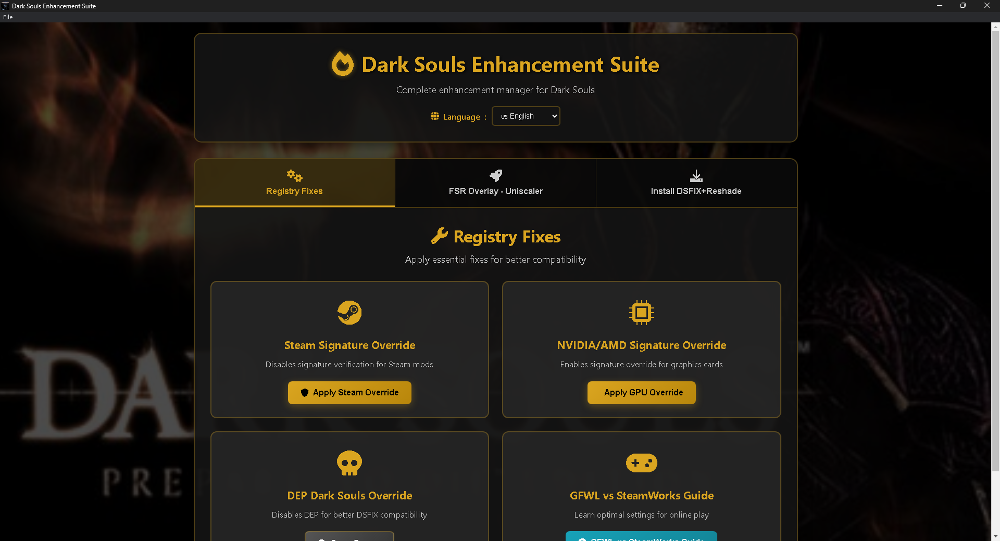
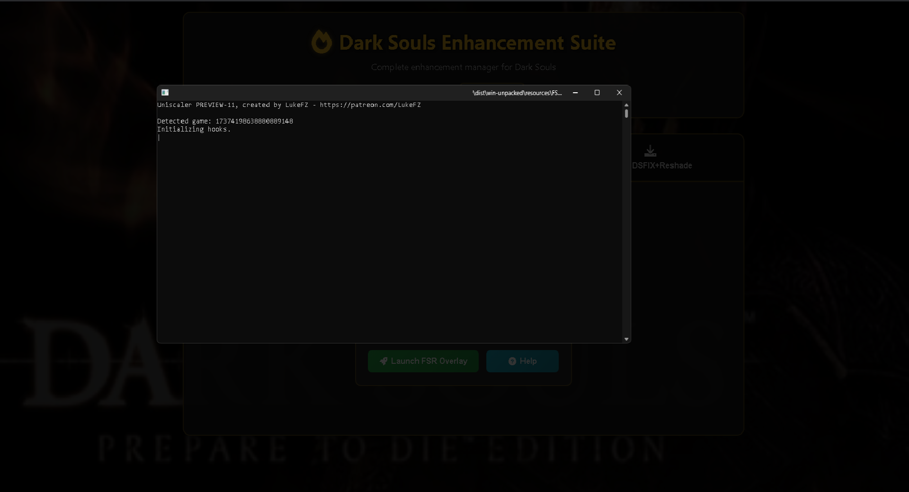
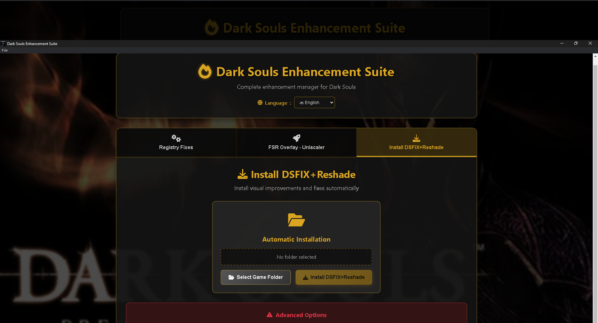

<div align="center">

# Dark Souls PTDE Enhancement Suite

[](https://github.com/Spet001/Dark-Souls-PTDE-Enhancement-Suite)
[](./LICENSE)
[](#installation)
[](../../releases)

**A comprehensive enhancement suite for Dark Souls: Prepare to Die Edition**

*Registry fixes • FSR upscaling • Visual mods installer • GFWL documentation*

[Download Latest Release](../../releases) • [Report Bug](../../issues) • [Request Feature](../../issues)



</div>

---

## �️ Screenshots

<div align="center">

### Registry Fixes Tab


### FSR Overlay Launcher


### DSFIX+ReShade Installer


</div>

---

##  Table of Contents

- [Overview](#-overview)
- [Screenshots](#️-screenshots)
- [Features](#-features)
- [Installation](#-installation)
- [Usage Guide](#-usage-guide)
- [Advanced Configuration](#-advanced-configuration)
- [Troubleshooting](#-troubleshooting)
- [Development](#-development)
- [Contributing](#-contributing)
- [License](#-license)

---

## 🎮 Overview

The **Dark Souls PTDE Enhancement Suite** is a comprehensive toolkit designed to enhance your Dark Souls: Prepare to Die Edition experience. This all-in-one application provides registry fixes, FSR upscaling, automatic mod installation, and detailed documentation for both GFWL and SteamWorks versions.

### Key Benefits

- ✅ **One-click registry fixes** for compatibility issues
- ✅ **Integrated FSR upscaling** with frame generation
- ✅ **Automatic DSFIX+ReShade installation**
- ✅ **GFWL vs SteamWorks documentation**
- ✅ **Safe and reversible** modifications
- ✅ **Modern, intuitive interface**

---

## ✨ Features

### 🔧 Registry Fixes
| Feature | Description | Benefit |
|---------|-------------|---------|
| **Steam Signature Override** | Disables Steam signature verification | Enables Steam mods and modifications |
| **GPU Signature Override** | Enables NVIDIA/AMD signature bypass | Allows unsigned driver modifications |
| **DEP Override** | Disables Data Execution Prevention | Improves DSFIX compatibility |
| **Automatic Game Detection** | Scans system for Dark Souls installations | Finds games in Steam, GFWL, and custom paths |

### 🖼️ FSR Overlay - Uniscaler Launcher
| Feature | Description | Benefit |
|---------|-------------|---------|
| **Lossless Scaling Integration** | Launches FSR overlay application | 900p→1080p upscaling with minimal performance loss |
| **Frame Generation** | AI-powered frame interpolation | 30→60 FPS or 60→120 FPS gameplay |
| **Multi-API Support** | DirectX 11/12 and Vulkan compatibility | Works with various graphics configurations |
| **Comprehensive Documentation** | Built-in setup guides | Easy configuration for optimal performance |

### 💾 DSFIX+ReShade Installer
| Feature | Description | Benefit |
|---------|-------------|---------|
| **Automatic Installation** | One-click mod installation | Copies all necessary files (DLLs, configs, shaders) |
| **Automatic Backup** | Preserves original files | Safe modification with easy restoration |
| **RTGI Support** | Experimental ray tracing setup | Enhanced visual fidelity (use with caution) |
| **120FPS Configuration** | Physics-safe high refresh rate | High FPS without breaking game mechanics |

### 🌐 Interface & Usability
- **Dark Souls Theme**: Official game background and styling
- **Multilingual Support**: English (default) and Portuguese Brazilian
- **Tabbed Navigation**: Organized feature separation
- **Real-time Feedback**: Visual notifications and progress indicators
- **Integrated Help**: Built-in documentation and guides

---

## 📥 Installation

### Method 1: Pre-built Installer (Recommended)

1. **Download** the latest `Dark Souls Enhancement Suite Setup.exe` from [Releases](../../releases)
2. **Run as Administrator** (required for registry modifications)
3. **Follow the installer** prompts
4. **Launch** from desktop shortcut or start menu

### Method 2: Build from Source

#### Prerequisites
- Windows 10/11
- Node.js 16+ and npm
- Git

#### Build Steps
```bash
# Clone the repository
git clone https://github.com/Spet001/Dark-Souls-PTDE-Enhancement-Suite.git
cd Dark-Souls-PTDE-Enhancement-Suite

# Install dependencies
npm install

# Run in development mode
npm start

# Build installer
npm run build-win
```

---

## 📖 Usage Guide

### 🚀 Quick Start

1. **Launch as Administrator** (essential for registry modifications)
2. **Select your task** from the three main tabs:
   - **Registry Fixes**: System compatibility
   - **FSR Overlay**: Performance enhancement  
   - **DSFIX+ReShade**: Visual improvements

### Tab 1: Registry Fixes

#### Steam Signature Override
```
Purpose: Enables Steam mods and modifications
Usage: Click "Apply Steam Override" → Restart Steam
Effect: Disables Steam's mod verification system
```

#### GPU Signature Override  
```
Purpose: Allows unsigned graphics driver modifications
Usage: Click "Apply GPU Override" → Restart system
Effect: Enables custom graphics modifications
```

#### DEP Override for Dark Souls
```
Purpose: Improves DSFIX compatibility
Usage: 
1. Click "Scan for Games"
2. Select found Dark Souls installations
3. Click "Apply DEP Fix" for each game
4. Verify with "Check Status"
```

#### GFWL vs SteamWorks Guide
Essential documentation for online play configuration based on your Dark Souls version.

### Tab 2: FSR Overlay - Uniscaler

#### Launch FSR Overlay
```
Purpose: Start the FSR upscaling application
Usage: Click "Launch FSR Overlay"
Configuration: Use 900p→1080p for optimal balance
```

#### Recommended Settings
- **Resolution**: 900p input → 1080p output
- **Frame Generation**: 2x (30→60 FPS or 60→120 FPS)  
- **Mode**: Windowed for best compatibility
- **Game FPS Limit**: Keep at 60 FPS max in DSfix.ini

### Tab 3: DSFIX+ReShade Installation

#### Automatic Installation
```
1. Click "Select Game Folder"
2. Navigate to your Dark Souls installation (where DATA.exe is located)
3. Click "Install DSFIX+ReShade"
4. Wait for completion confirmation
```

#### What Gets Installed
- **dsfix/** folder with all configuration files
- **reshade-shaders/** folder with visual effects
- **d3d9.dll** (DSFIX main library)
- **d3d9_vulkan.dll** (Vulkan wrapper for RTGI)
- **DINPUT8.dll** (ReShade input hook)
- **Configuration files** (.ini files for customization)

---

## ⚙️ Advanced Configuration

### 🌈 Experimental RTGI (Ray Tracing)

> ⚠️ **WARNING**: Use at your own risk - may cause instability!

#### Setup Steps
1. Navigate to your Dark Souls installation folder
2. Open `DSfix.ini` in a text editor
3. Find: `dinput8dllWrapper none`
4. Change to: `dinput8dllWrapper d3d9_vulkan.dll`
5. Save and restart the game

#### Technical Details
- **Vulkan Wrapper**: Makes Vulkan the primary API
- **ReShade Compilation**: RTGI compiles in-game
- **Performance Impact**: Significant FPS reduction expected
- **Compatibility**: May cause crashes or visual artifacts

### 🏃‍♂️ Physics-Safe 120FPS Setup

#### Display Configuration
1. **Windowed Mode**: Set Dark Souls to windowed mode
2. **Lower Resolution**: Use 900p instead of 1080p native
3. **Alternative**: Configure 1080p → 1440p upscaling

#### Recommended Settings
- **Game FPS**: Keep DSfix limited to 60 FPS maximum
- **FSR Frame Generation**: Handle high refresh rate externally
- **Resolution**: 900p → 1080p for optimal balance
- **Testing**: Monitor physics in elevators, ladders, collision detection

### 🔍 Game Detection Paths

The suite automatically scans these locations for Dark Souls PTDE:

#### Steam Installations
- `Steam\steamapps\common\DARK SOULS Prepare To Die Edition`
- Multiple drive locations (C:, D:, E:, F:)

#### GFWL/Games for Windows Live
- `Microsoft Games\DARK SOULS Prepare To Die Edition`
- `Games for Windows - LIVE\Games\DARK SOULS`

#### Publisher Paths
- `FromSoftware\DARK SOULS Prepare To Die Edition`
- `Bandai Namco Games\DARK SOULS Prepare To Die Edition`

#### Custom/Legacy Locations
- `C:\Games\DARK SOULS*`
- Root drive installations
- Various naming conventions

---

## 🔧 Troubleshooting

### Common Issues

#### "Access Denied" or Registry Errors
```
Solution: Run as Administrator
Why: Registry modifications require elevated privileges
```

#### PowerShell Execution Errors
```
Solution: Set execution policy
Command: Set-ExecutionPolicy -ExecutionPolicy RemoteSigned -Scope CurrentUser
```

#### FSR Overlay Won't Launch
```
Verify: FSR Overlay - Uniscaler folder exists
Check: Scaling.exe is present and not corrupted
Solution: Reinstall or redownload the FSR overlay package
```

#### DSFIX Installation Fails
```
Verify: Selected folder contains DATA.exe
Check: Sufficient disk space available
Solution: Run as Administrator and try again
```

#### Game Not Detected in Scan
```
Manually navigate: Use "Select Game Folder" in DSFIX tab
Verify location: Ensure DATA.exe is in the selected folder
Custom path: Add your installation path to scan-games.ps1
```

### Performance Issues

#### Low FPS After DSFIX Installation
```
1. Open DSfix.ini
2. Set unlockFPS 0 (lock to 30 FPS)
3. Use FSR for higher frame rates instead
```

#### FSR Overlay Performance Problems
```
1. Lower input resolution (try 720p)
2. Disable frame generation temporarily  
3. Use windowed mode instead of fullscreen
```

---

## 🛠️ Development

### Project Structure
```
dsfix-registry-manager/
├── 📄 main.js              # Electron main process
├── 📄 preload.js           # Secure context bridge
├── 📄 index.html           # Main interface
├── 📄 styles.css           # Dark Souls themed styling
├── 📄 renderer.js          # UI logic and event handlers
├── 📄 package.json         # Project configuration
├── 📁 js/
│   └── 📄 translations.js  # Multilingual support
├── 📁 scripts/             # PowerShell automation
│   ├── 📄 scan-games.ps1      # Game detection
│   ├── 📄 apply-fix.ps1       # Registry modifications
│   ├── 📄 remove-fix.ps1      # Registry restoration
│   ├── 📄 check-status.ps1    # Status verification
│   └── 📄 install-dsfix.ps1   # Mod installation
└── 📁 assets/              # Icons and resources
```

### Technologies Used
- **Electron**: Cross-platform desktop application framework
- **Node.js**: Backend processing and file operations
- **PowerShell**: Windows system integration
- **HTML/CSS/JavaScript**: Modern web technologies for UI
- **NSIS**: Windows installer creation

### Building

#### Development Mode
```bash
npm start                    # Run in development
npm run build-win           # Build Windows installer
```

#### Release Configuration
- **Target**: Windows 10/11
- **Architecture**: x64
- **Installer**: NSIS with admin privileges
- **Dependencies**: Bundled in extraResources

---

## 🤝 Contributing

### How to Contribute

1. **Fork** the repository
2. **Create** a feature branch (`git checkout -b feature/amazing-feature`)
3. **Commit** your changes (`git commit -m 'Add amazing feature'`)
4. **Push** to the branch (`git push origin feature/amazing-feature`)
5. **Open** a Pull Request

### Contribution Guidelines

- 🔍 **Test thoroughly** on clean Windows installations
- 📝 **Document** new features and changes
- 🏗️ **Follow** existing code style and structure
- 🛡️ **Ensure** security best practices for registry modifications
- 🌐 **Update** translations for new UI elements

### Development Environment Setup

```bash
# Prerequisites
node --version          # Verify Node.js 16+
npm --version          # Verify npm availability

# Setup
git clone [your-fork-url]
cd Dark-Souls-PTDE-Enhancement-Suite
npm install
npm start              # Launch in development mode
```

---

## 📜 License

This project is licensed under the **MIT License** - see the [LICENSE](LICENSE) file for details.

### What this means:
- ✅ **Free to use** for personal and commercial purposes
- ✅ **Free to modify** and distribute
- ✅ **No warranty** - use at your own risk
- ❗ **Attribution required** - credit the original authors

---

## ⚠️ Legal Disclaimer

This application modifies Windows registry entries and game files. While designed to be safe and reversible:

- 🔄 **Always backup** your save files before using experimental features
- 👨‍💻 **Use at your own risk** - the developers are not responsible for system issues
- 🎮 **Game stability** may be affected by modifications
- 🔐 **Administrator privileges** are required for proper functionality

---

## 🙏 Acknowledgments

- **FromSoftware** - For creating the masterpiece that is Dark Souls
- **DSFIX Community** - For the original DSFIX modifications and community support
- **ReShade Project** - For the visual enhancement framework
- **FSR/Uniscaler Developers** - For the upscaling technology
- **Electron Team** - For the cross-platform application framework

---

<div align="center">

**Made with ❤️ for the Dark Souls community**

[⬆ Back to Top](#dark-souls-ptde-enhancement-suite)

</div>